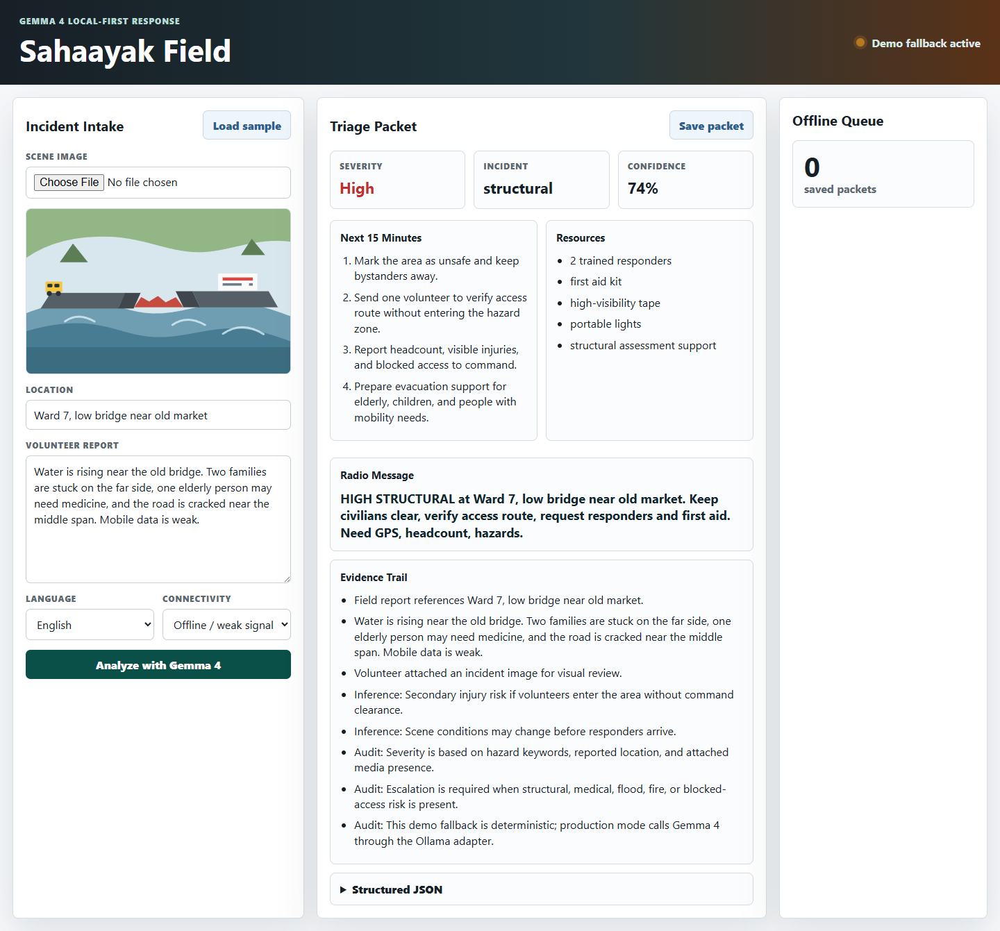

# Sahaayak Field

Local-first disaster triage assistant for the Kaggle Gemma 4 Good Hackathon.

Sahaayak Field helps trained volunteers turn messy field evidence into an auditable response packet when connectivity is weak. A volunteer can submit a scene image, short report, location hint, language preference, and connectivity state. Gemma 4 returns a structured incident type, severity, next actions, resource request, radio message, and evidence trail.



## Competition Positioning

- Primary track: Global Resilience
- Main track angle: high-impact local AI for field response
- Special technology angle: Gemma 4 running locally through Ollama, with a path to LiteRT or llama.cpp for edge deployment
- Video hook: "No internet. A damaged bridge. A volunteer has one phone and two minutes."

## Why Gemma 4

The project is designed around Gemma 4 strengths:

- Multimodal understanding for scene images and field text
- Native structured JSON output for triage packets
- Function/tool-call friendly architecture for command-center integrations
- Long context for local SOPs, shelter lists, and supply catalogs
- Local deployment potential for privacy and low-connectivity settings
- Multilingual response generation for diverse volunteer teams

## Run The Prototype

Requirements:

- Node.js 20 or newer
- Optional: Ollama with a Gemma 4 model pulled locally

Start the app:

```powershell
npm start
```

Open:

```text
http://localhost:4173
```

Use a local Gemma 4 model through Ollama:

```powershell
$env:GEMMA_MODEL="gemma4:e4b"
$env:OLLAMA_URL="http://localhost:11434/api/chat"
npm start
```

Force deterministic demo mode:

```powershell
$env:USE_DEMO="1"
npm start
```

The app falls back to deterministic demo output if Ollama is not reachable. For a final Kaggle submission video, record with the real Gemma 4 runtime active and keep the visible model status in frame.

## Repository Map

- `server.mjs` - Static server and Gemma 4/Ollama inference adapter
- `prompts/gemma-system.md` - Safety-focused system prompt
- `public/` - Browser app, styles, client logic, sample incident asset
- `docs/writeup-draft.md` - Kaggle Writeup draft under 1,500 words
- `docs/video-script.md` - 3-minute video script and shot list
- `docs/architecture.md` - Mermaid architecture diagram for the repo or writeup
- `docs/submission-checklist.md` - Final deadline checklist
- `examples/sample-packet.json` - Example triage output
- `media/app-screenshot.png` - Verified browser screenshot
- `media/kaggle-cover.png` - Cover image for the Kaggle Media Gallery
- `media/kaggle-cover.svg` - Editable cover source

## Final Submission Notes

Before submitting:

- Publish the repo publicly.
- Deploy the live demo or attach runnable files.
- Record the YouTube video at 3 minutes or less.
- Attach the video and a cover image in the Kaggle Media Gallery.
- Add repo and demo links under Kaggle Writeup Project Links.
- Disable forced demo mode for the final technical proof.
