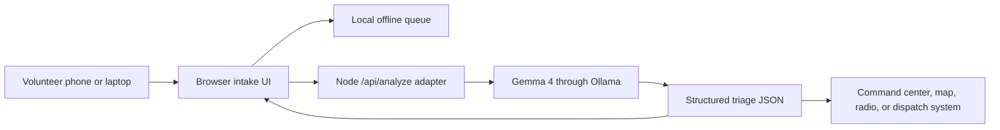

# Architecture

## Data Flow

1. Volunteer adds a scene image, location hint, field report, language, and connectivity state.
2. Browser sends the packet to `/api/analyze`.
3. Node adapter loads `prompts/gemma-system.md` and asks Gemma 4 for schema-constrained JSON.
4. UI renders severity, immediate actions, resources, evidence trail, radio message, and raw JSON.
5. Volunteer saves the packet into the offline queue until signal returns.

## Model Boundary

Gemma 4 performs multimodal interpretation, operational reasoning, and structured JSON generation. The app is responsible for display, storage, labeling fallback mode, and preserving the audit trail.

